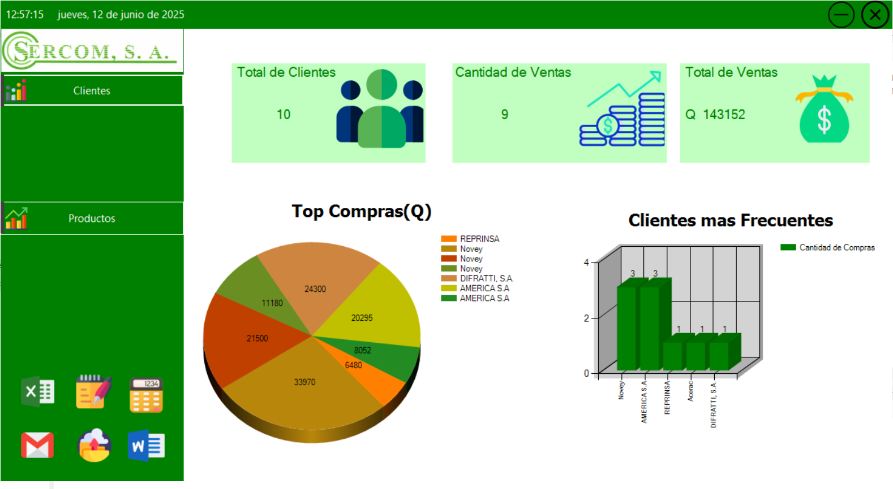
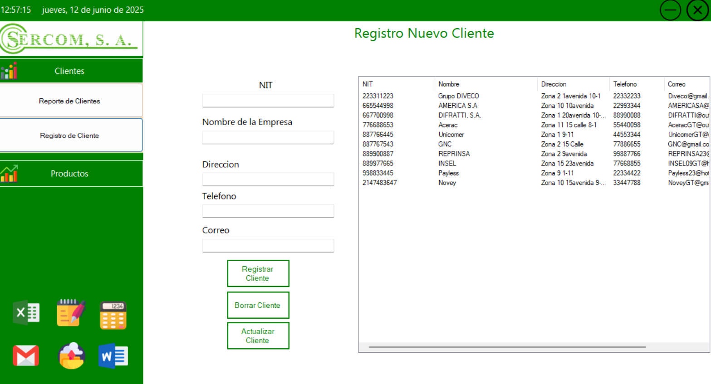
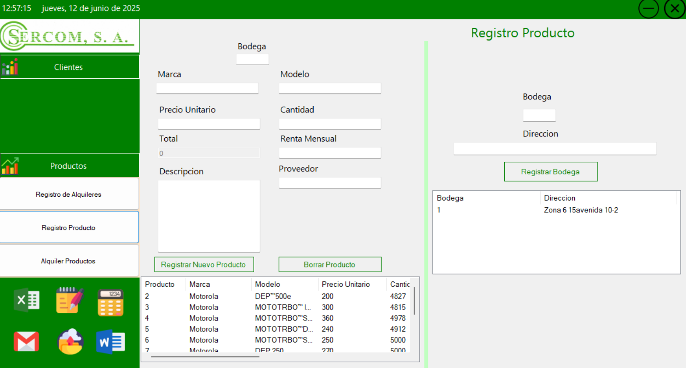
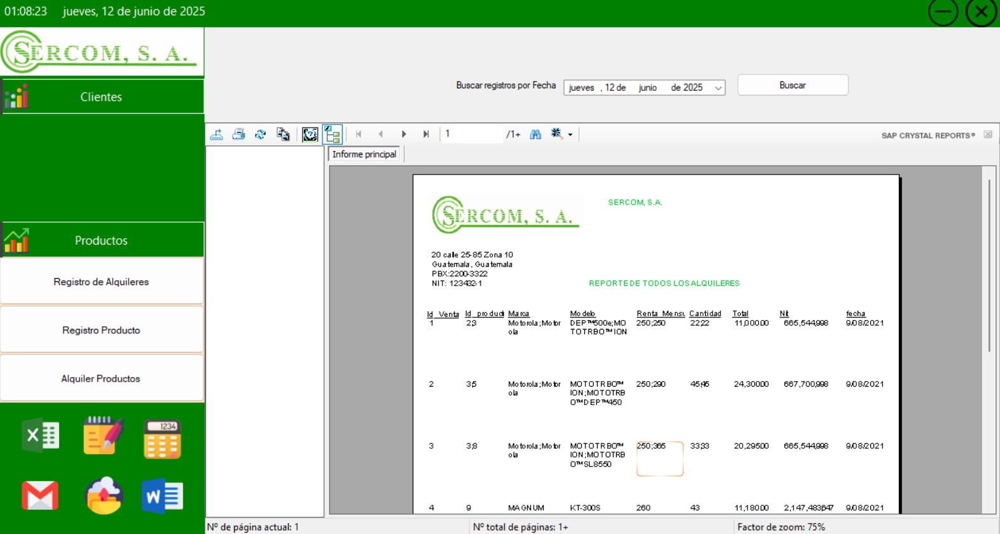

# CSharp-Desktop-Sales-Manager

   

A comprehensive desktop sales and inventory management system built with C# WinForms and connected to a MySQL database. This project was developed as an academic exercise and serves as a portfolio piece to demonstrate foundational skills in object-oriented programming, database interaction, and user interface design for desktop applications.

---

## 📸 Application Showcase

### Main Dashboard
The main dashboard provides an at-a-glance overview of key business metrics, including total clients, sales volume, and dynamic charts for top customer purchases and frequency.



### Client Management
A full CRUD (Create, Read, Update, Delete) interface to manage all company clients. Data is displayed in a list view for easy access and modification.



### Product & Inventory Management
This module allows for the registration of new products, including details like brand, model, unit price, stock quantity, and rental fees.



### Reporting with Crystal Reports
The system uses SAP Crystal Reports to generate detailed, printable reports for sales and rentals, which can be filtered by date for specific insights.



---

## ✨ Features

*   **Dashboard & Analytics:** A visual dashboard with key performance indicators (KPIs) and charts for data-driven insights.
*   **Client Management:** A robust module for handling all client information with full CRUD functionality.
*   **Product Inventory:** Comprehensive management of products available for sale or rent.
*   **Sales Processing:** A dedicated form to process new sales, apply discounts, and generate transactions.
*   **Dynamic Reporting:** Generation of detailed reports using Crystal Reports.
*   **External App Shortcuts:** Quick access to essential tools like Excel, Gmail, and Notepad directly from the side menu.

---

## 🛠️ Tech Stack

*   **Frontend:** C# with Windows Forms (.NET Framework 4.8)
*   **Database:** MySQL
*   **Reporting:** SAP Crystal Reports for Visual Studio
*   **IDE:** Visual Studio

---

## 🚀 Getting Started

Follow these instructions to get a copy of the project up and running on your local machine for development and testing purposes.

### Prerequisites

*   [Visual Studio 2019 or later](https://visualstudio.microsoft.com/)
*   [MySQL Server](https://dev.mysql.com/downloads/mysql/) (e.g., via XAMPP, WAMP, or standalone)
*   [MySQL Connector/NET](https://dev.mysql.com/downloads/connector/net/)
*   [SAP Crystal Reports for Visual Studio](https://www.sap.com/products/crystal-reports/trial.html) (Developer Edition for VS and the Runtime)

### Installation Steps

1.  **Clone the repository:**
    ```bash
    git clone https://github.com/Jorge-Cuevas90003/CSharp-Desktop-Sales-Manager.git
    cd CSharp-Desktop-Sales-Manager
    ```

2.  **Set up the database:**
    *   Using a tool like phpMyAdmin or MySQL Workbench, create a new database named `prueba1`.
    *   Import the `database/schema.sql` file to create all the necessary tables and populate them with sample data.

3.  **Configure the connection string:**
    *   Open `app.config` and update the `connectionString` with your MySQL password:
        ```xml
        <add name="MiConexion"
             connectionString="datasource=localhost;port=3306;username=yours;password=yours;database=prueba1"
             providerName="MySql.Data.MySqlClient"/>
        ```

4.  **Run the application:**
    *   Open the `prueba1.sln` file in Visual Studio.
    *   Visual Studio should automatically restore the NuGet packages. If not, right-click the solution and select "Restore NuGet Packages".
    *   Press `F5` or click "Start" to build and run the project.

---

## 💡 Code Reflection & Future Improvements

As an early project in my development journey, this application was a fantastic learning experience. If I were to rebuild it today, I would make several improvements based on modern best practices:

*   **Security First:** The current implementation constructs SQL queries using string concatenation, which is highly vulnerable to **SQL Injection**.
    > **Actionable Improvement:** Refactor all database calls to use **parameterized queries** (e.g., `MySqlCommand.Parameters.AddWithValue`) to completely mitigate this critical security risk.


*   **Modern UI/UX:** Windows Forms is a classic framework, but modern applications often use more flexible UI technologies.
    > **Actionable Improvement:** Rebuild the UI using a more modern framework like WPF, .NET MAUI for cross-platform support, or even as a web application using ASP.NET Core.

---

## 📝 License

This project is licensed under the MIT License. See the [LICENSE](LICENSE.txt) file for details.
